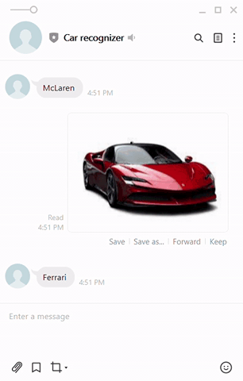

# car-recognizer

===========
### Project overview
Car recognition chat bot using LINE API. It automatically recognizes and replies correct brand of the car in the images sent by the user. 

### Project functionality
It is basically described in overview part. Also, it only recognizes particular brands of the car which are; Lamborghini, McLaren, Ferrari, Bugatti, and Rolls Royce. Moreover,  this chat bot does not actually "chat" with the user, so it will only recognize images but does not reply anything for any words sent by the user.

### Technologies used in this Project 
Many articles on the internet describes how to create a chat bot with LINE API, but I did not want to fully copy those. Thus, I used whatever I learnt previously to accomplish this project. Here is a list of technologies that I used:  
  * Flask framework to create main system. 
  * Created CI/CD pipeline with:
    * Travis CI for CI tool (automated testing)
    * heroku for deploy 
  * Docker/docker-compose to integrate testing/deploy environment
  * Used tensorflow/keras to construct prediction model of images (fine-tuned model with Xception-Net)
